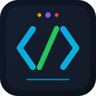

# 🛠️ DevTools Hub

<div align="center">



**All-in-One Developer Tools Platform**

*Tools, React Apps, dan HTML Apps — semua auto-detected dan siap pakai.*

[](https://reactjs.org/)
[](https://www.typescriptlang.org/)
[](https://vitejs.dev/)
[](https://tailwindcss.com/)
[](https://web.dev/progressive-web-apps/)

[Demo](#demo) • [Features](#-features) • [Quick Start](#-quick-start) • [Documentation](#-documentation) • [Contributing](#-contributing)

</div>

---

## 📋 Table of Contents

- [Features](#-features)
- [Quick Start](#-quick-start)
- [Project Structure](#-project-structure)
- [Documentation](#-documentation)
  - [Adding Tools](#-adding-tools)
  - [Adding TSX Apps](#-adding-tsx-react-apps)
  - [Adding HTML Apps](#-adding-html-apps)
- [PWA Support](#-pwa-support)
- [Tech Stack](#-tech-stack)
- [Scripts](#-scripts)
- [Configuration](#-configuration)
- [Contributing](#-contributing)
- [License](#-license)

---

## ✨ Features

### Core Features

| Feature | Description |
|---------|-------------|
| 🔒 **Privacy First** | Semua tools berjalan 100% di browser. Tidak ada data yang dikirim ke server |
| 📱 **Fully Responsive** | Optimized untuk desktop, tablet, dan mobile dengan UI yang adaptif |
| ⚡ **Fast & Lightweight** | Built dengan Vite + SWC untuk loading super cepat |
| 🎨 **Modern UI** | Dark theme dengan glass-morphism dan animasi smooth (Framer Motion) |
| 📲 **PWA Support** | Installable di mobile & desktop dengan offline support |
| 🔄 **Auto Update** | Notifikasi otomatis saat ada versi baru |

### Auto-Detection System

| Type | Location | Detection |
|------|----------|-----------|
| 🛠️ **Tools** | `src/pages/tools/` | Manual register di `toolRegistry.ts` |
| ⚛️ **TSX Apps** | `src/apps/` | **Auto-detected!** Zero config |
| 🌐 **HTML Apps** | `public/justhtml/` | **Auto-detected!** Zero config |

### Navigation Features

| Feature | Description |
|---------|-------------|
| 🔙 **Smart Back Navigation** | Kembali ke tab yang sama setelah dari app/tool |
| 📍 **Scroll Position Memory** | Posisi scroll tersimpan saat navigasi |
| 🔍 **Search Persistence** | Query pencarian tidak hilang saat back |
| 🆕 **Open in New Tab** | Buka app di tab baru dalam standalone mode |

---

## 🚀 Quick Start

### Prerequisites

- **Node.js** >= 18.x
- **npm** >= 9.x atau **bun** >= 1.x

### Installation

```bash
# Clone repository
git clone https://github.com/your-username/devtools-hub.git
cd devtools-hub

# Install dependencies
npm install

# Start development server
npm run dev
```

Buka [http://localhost:8080](http://localhost:8080) di browser.

### Build for Production

```bash
# Build
npm run build

# Preview production build
npm run preview
```

---

## 📁 Project Structure

```
devtools-hub/
├── public/
│   ├── icons/                    # PWA icons (auto-generated)
│   │   ├── icon.svg              # Source SVG icon
│   │   ├── icon-72x72.png        # PWA icons
│   │   ├── icon-192x192.png
│   │   ├── icon-512x512.png
│   │   └── apple-touch-icon.png
│   ├── justhtml/                 # 🌐 HTML Apps (Auto-Detected!)
│   │   ├── calculator.html       # Single file app
│   │   ├── snake/                # Multi-file app
│   │   │   ├── index.html        # Entry point (required)
│   │   │   ├── styles.css
│   │   │   └── script.js
│   │   └── quiz-game/
│   │       ├── index.html
│   │       └── ...
│   └── robots.txt
│
├── src/
│   ├── apps/                     # ⚛️ TSX Apps (Auto-Detected!)
│   │   ├── HelloWorld.tsx        # Single file app
│   │   ├── counter-app/          # Multi-file app
│   │   │   ├── index.tsx         # Entry point (required)
│   │   │   └── components/
│   │   └── enigma/
│   │       └── index.tsx
│   │
│   ├── components/
│   │   ├── ui/                   # shadcn/ui components
│   │   ├── Header.tsx            # Main header
│   │   ├── UnifiedCard.tsx       # App/Tool card
│   │   ├── UnifiedGrid.tsx       # Grid layout
│   │   ├── PWAUpdatePrompt.tsx   # PWA update notification
│   │   └── ...
│   │
│   ├── lib/
│   │   ├── toolRegistry.ts       # Tools configuration
│   │   ├── appRegistry.ts        # TSX & HTML apps auto-detection
│   │   ├── unifiedRegistry.ts    # Unified registry (all items)
│   │   └── utils.ts              # Utility functions
│   │
│   ├── pages/
│   │   ├── tools/                # 🛠️ Tool pages
│   │   │   ├── Base64EncoderPage.tsx
│   │   │   ├── JsonFormatterPage.tsx
│   │   │   └── ...
│   │   ├── Index.tsx             # Homepage
│   │   ├── TsxAppWrapper.tsx     # TSX app wrapper with header
│   │   ├── HtmlAppWrapper.tsx    # HTML app wrapper with iframe
│   │   └── NotFound.tsx
│   │
│   ├── hooks/                    # Custom React hooks
│   ├── types/                    # TypeScript declarations
│   ├── App.tsx                   # Main app with routing
│   ├── main.tsx                  # Entry point + PWA registration
│   └── index.css                 # Global styles + Tailwind
│
├── scripts/
│   └── generate-icons.mjs        # PWA icon generator
│
├── vite.config.ts                # Vite + PWA configuration
├── tailwind.config.ts            # Tailwind configuration
├── tsconfig.json                 # TypeScript configuration
└── package.json
```

---

## 📖 Documentation

### 🛠️ Adding Tools

Tools adalah utilitas developer yang di-register manual di `toolRegistry.ts`.

#### Step 1: Create Tool Page

```tsx
// src/pages/tools/MyToolPage.tsx
import { useState } from 'react';
import { ToolLayout } from '@/components/ToolLayout';
import { Button } from '@/components/ui/button';

const MyToolPage = () => {
  const [input, setInput] = useState('');
  const [output, setOutput] = useState('');

  const handleProcess = () => {
    // Your tool logic here
    setOutput(input.toUpperCase());
  };

  return (
    <ToolLayout
      title="My Tool"
      description="Description of what this tool does"
    >
      <div className="space-y-4">
        <textarea
          value={input}
          onChange={(e) => setInput(e.target.value)}
          placeholder="Enter input..."
          className="tool-input min-h-[200px]"
        />
        
        <Button onClick={handleProcess}>
          Process
        </Button>
        
        <div className="tool-output">
          {output}
        </div>
      </div>
    </ToolLayout>
  );
};

export default MyToolPage;
```

#### Step 2: Register in toolRegistry.ts

```typescript
// src/lib/toolRegistry.ts
export const tools: Tool[] = [
  // ... existing tools
  {
    id: 'my-tool',
    name: 'My Tool',
    description: 'Description of what this tool does',
    category: 'text',  // converter | developer | text | utility
    icon: Wand2,       // Lucide icon
    featured: false,
    path: '/tools/my-tool',
    tags: ['tool', 'utility'],
  },
];
```

#### Step 3: Add Route in App.tsx

```tsx
// src/App.tsx
const MyToolPage = lazy(() => import('@/pages/tools/MyToolPage'));

// In routes array:
{ path: '/tools/my-tool', element: <MyToolPage /> },
```

---

### ⚛️ Adding TSX (React) Apps

TSX apps are **auto-detected** from `src/apps/`. No configuration needed!

#### Option A: Single File App

```tsx
// src/apps/MyApp.tsx

// Optional: Export metadata for customization
export const appMeta = {
  name: 'My App',                    // Display name (default: from filename)
  description: 'App description',    // Short description
  category: 'Tools' as const,        // Games | Tools | Productivity | Education | Entertainment | Other
  icon: '🚀',                        // Emoji or Lucide icon name
  featured: true,                    // Show featured badge
};

export default function MyApp() {
  return (
    <div className="min-h-screen bg-background p-4">
      <h1 className="text-2xl font-bold">My App</h1>
      {/* Your app content */}
    </div>
  );
}
```

✅ **Done!** App available at `/apps/my-app`

#### Option B: Multi-file App (Project Folder)

```
src/apps/my-project/
├── index.tsx              ← Entry point (REQUIRED!)
├── components/
│   ├── Header.tsx
│   └── Footer.tsx
├── hooks/
│   └── useMyHook.ts
└── utils/
    └── helpers.ts
```

```tsx
// src/apps/my-project/index.tsx
import Header from './components/Header';
import Footer from './components/Footer';

export const appMeta = {
  name: 'My Project',
  description: 'A complex multi-file app',
  category: 'Productivity' as const,
  icon: '📦',
};

export default function MyProject() {
  return (
    <div className="min-h-screen bg-background">
      <Header />
      <main className="p-4">
        {/* Content */}
      </main>
      <Footer />
    </div>
  );
}
```

#### App Categories

| Category | Description |
|----------|-------------|
| `Games` | Games and entertainment |
| `Tools` | Utility tools |
| `Productivity` | Productivity apps |
| `Education` | Learning and educational |
| `Entertainment` | Fun and entertainment |
| `Other` | Miscellaneous |

---

### 🌐 Adding HTML Apps

HTML apps are **auto-detected** from `public/justhtml/`. No configuration needed!

#### Option A: Single HTML File

```html
<!-- public/justhtml/my-app.html -->
<!DOCTYPE html>
<html lang="en">
<head>
  <meta charset="UTF-8">
  <meta name="viewport" content="width=device-width, initial-scale=1.0">
  <title>My HTML App</title>
  <style>
    * { margin: 0; padding: 0; box-sizing: border-box; }
    body { 
      font-family: system-ui, sans-serif;
      background: #0c1117;
      color: #fff;
      min-height: 100vh;
      padding: 20px;
    }
  </style>
</head>
<body>
  <h1>My HTML App</h1>
  <p>Your content here...</p>
  
  <script>
    // Your JavaScript here
  </script>
</body>
</html>
```

✅ **Done!** App available at `/justhtml/my-app`

#### Option B: Multi-file App (Project Folder)

```
public/justhtml/my-game/
├── index.html        ← Entry point (REQUIRED!)
├── styles.css
├── script.js
└── assets/
    └── images/
```

```html
<!-- public/justhtml/my-game/index.html -->
<!DOCTYPE html>
<html lang="en">
<head>
  <meta charset="UTF-8">
  <meta name="viewport" content="width=device-width, initial-scale=1.0">
  <title>My Game</title>
  <link rel="stylesheet" href="styles.css">
</head>
<body>
  <div id="game-container"></div>
  <script src="script.js"></script>
</body>
</html>
```

---

## 📲 PWA Support

DevTools Hub is a fully-featured Progressive Web App.

### Features

- ✅ **Installable** - Install on mobile & desktop
- ✅ **Offline Support** - Works without internet (cached assets)
- ✅ **Auto Update** - Notification when new version available
- ✅ **Native-like** - Standalone mode without browser UI

### Installation

**Desktop (Chrome/Edge):**
1. Click the install icon in address bar
2. Or click "Install" in browser menu

**Mobile (Android):**
1. Tap "Add to Home Screen" in browser menu
2. Or accept the install prompt

**Mobile (iOS):**
1. Tap Share button
2. Select "Add to Home Screen"

### Generating Icons

```bash
# Generate all PWA icons from SVG
node scripts/generate-icons.mjs
```

This generates:
- `icon-72x72.png` to `icon-512x512.png` (PWA icons)
- `apple-touch-icon.png` (iOS)
- `favicon-16x16.png`, `favicon-32x32.png`

---

## 🛠️ Tech Stack

| Technology | Purpose |
|------------|---------|
| **React 18** | UI Framework |
| **TypeScript** | Type Safety |
| **Vite** | Build Tool & Dev Server |
| **SWC** | Fast TypeScript/JSX Compiler |
| **TailwindCSS** | Utility-first CSS |
| **shadcn/ui** | UI Component Library |
| **Framer Motion** | Animations |
| **React Router** | Client-side Routing |
| **Lucide React** | Icon Library |
| **vite-plugin-pwa** | PWA Support |
| **Workbox** | Service Worker & Caching |

---

## 📜 Scripts

| Script | Description |
|--------|-------------|
| `npm run dev` | Start development server (port 8080) |
| `npm run build` | Build for production |
| `npm run build:dev` | Build with development flags |
| `npm run preview` | Preview production build |
| `npm run lint` | Run ESLint |
| `node scripts/generate-icons.mjs` | Generate PWA icons |

---

## ⚙️ Configuration

### Vite Configuration

Key configurations in `vite.config.ts`:

```typescript
export default defineConfig({
  server: {
    host: "::",
    port: 8080,
  },
  plugins: [
    react(),
    VitePWA({
      registerType: 'prompt',
      manifest: { /* PWA manifest */ },
      workbox: { /* Caching strategies */ },
    }),
  ],
  resolve: {
    alias: {
      "@": path.resolve(__dirname, "./src"),
    },
  },
});
```

### Tailwind Configuration

Custom design tokens in `tailwind.config.ts`:

- Custom colors (`primary`, `secondary`, `accent`)
- Dark theme by default
- Glass morphism utilities
- Responsive breakpoints

### Environment Variables

Create `.env.local` for local configuration:

```env
# Optional: Custom port
VITE_PORT=8080
```

---

## 🤝 Contributing

Contributions are welcome! Here's how you can help:

### Adding New Tools

1. Create tool page in `src/pages/tools/`
2. Register in `src/lib/toolRegistry.ts`
3. Add route in `src/App.tsx`
4. Submit PR

### Adding New Apps

1. **TSX Apps**: Just add to `src/apps/`
2. **HTML Apps**: Just add to `public/justhtml/`
3. No registration needed!
4. Submit PR

### Development Guidelines

- Follow existing code style (2-space indentation)
- Use TypeScript for all new code
- Use Tailwind CSS with semantic tokens
- Run `npm run lint` before committing
- Test on mobile viewport

### Commit Convention

```
feat: Add new feature
fix: Bug fix
docs: Documentation changes
style: Code style changes
refactor: Code refactoring
perf: Performance improvements
test: Add tests
chore: Build/config changes
```

---

## 📄 License

This project is open source and available under the [MIT License](LICENSE).

---

## 🙏 Acknowledgments

- [shadcn/ui](https://ui.shadcn.com/) - Beautiful UI components
- [Lucide](https://lucide.dev/) - Icon library
- [Framer Motion](https://www.framer.com/motion/) - Animation library
- [Vite](https://vitejs.dev/) - Next generation frontend tooling

---

<div align="center">

Made with ❤️ by the DevTools Hub Team

**100% Local • Privacy First • Zero Tracking**

</div>
